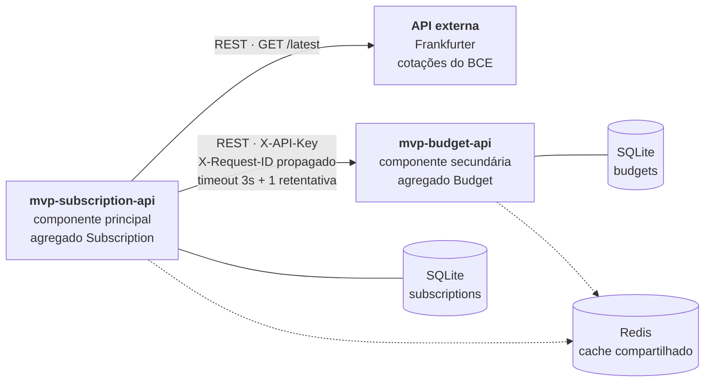

# MVP Subscription API

Componente **principal** do MVP de controle de assinaturas digitais, desenvolvido para a
disciplina de **Arquitetura de Software** da PUC-Rio.

O sistema resolve um problema simples de enunciar e chato de resolver na mão: **quanto custa, em
reais, o conjunto de assinaturas que você paga** — quando parte delas é cobrada em dólar ou euro,
em ciclos diferentes (mensal, trimestral, anual), e algumas você nem usa mais.

---

## Arquitetura



Três módulos, comunicação REST, **um deles externo**. Cada componente implementada tem
repositório próprio, banco próprio e `Dockerfile` próprio.

### Responsabilidades

| Componente | É dona de | Faz |
|---|---|---|
| `mvp-subscription-api` (esta) | `Subscription` | CRUD, consumo do câmbio, normalização em BRL, relatório de desperdício, orquestração |
| `mvp-budget-api` | `Budget` | metas por categoria, avaliação de estouro, projeção de desembolso |
| Frankfurter | — | cotações de referência do Banco Central Europeu |

A fronteira é o **agregado**, não a camada: cada serviço é dono do seu dado e ninguém escreve no
banco do outro. É por isso que a projeção mora no serviço de metas, e não aqui — ela é uma regra
sobre orçamento, não sobre assinaturas.

### Resiliência

A componente secundária ser derrubada **não derruba esta API**. As rotas consolidadas continuam
respondendo `200`, com o gasto calculado localmente, `budget_evaluation: null` e a limitação
declarada em `warnings`. O timeout é de 3s, com uma retentativa; um `4xx` não é repetido, porque
uma chave inválida não vira válida na segunda tentativa.

O mesmo vale para o câmbio: se a API externa cair, o serviço usa a **última cotação conhecida**,
marcada com `stale: true`, em vez de falhar.

---

## API externa: Frankfurter

| Item | Detalhe |
|---|---|
| **Serviço** | [Frankfurter](https://frankfurter.dev) |
| **O que fornece** | Taxas de câmbio de referência publicadas pelo Banco Central Europeu |
| **Custo** | Gratuito |
| **Cadastro** | **Não é necessário** |
| **Chave de API** | **Não utiliza** — nada de credencial para vazar em repositório público |
| **Licença** | Código do projeto sob licença Apache 2.0; os dados são de domínio público, publicados pelo BCE |
| **Base URL** | `https://api.frankfurter.dev/v1` |

**Rotas consumidas:**

| Rota | Uso nesta aplicação |
|---|---|
| `GET /v1/latest?base={moeda}&symbols=BRL` | Cotação usada ao cadastrar ou reprecificar uma assinatura |
| `GET /v1/currencies` | Lista de moedas válidas, usada para rejeitar moedas não cotadas |

**Como os dados são tratados** — o enunciado exige consumir e tratar, nunca redirecionar:

1. A cotação é buscada **no servidor**, nunca pelo cliente.
2. É convertida para `Decimal` e **gravada junto da assinatura** (`fx_rate_to_brl`,
   `fx_rate_date`), virando um registro histórico de quanto aquilo custava quando foi contratado.
3. É combinada com o ciclo de cobrança para produzir um **custo mensal normalizado em reais**,
   que é um dado nosso, e não da Frankfurter.
4. A rota `GET /api/v1/fx/rates` devolve as cotações **já no formato desta aplicação**, apenas das
   moedas em uso, com indicação de cotação defasada.

Em nenhum ponto o usuário é redirecionado para a API externa.

---

## Tecnologias

| Camada | Escolha |
|---|---|
| Linguagem | Python 3.13 |
| Framework | FastAPI (REST + OpenAPI/Swagger) |
| Persistência | SQLite via SQLAlchemy 2 (async, `aiosqlite`) |
| Cliente HTTP | httpx (async) |
| Cache | Redis, com queda automática para cache em memória |
| Testes | pytest + httpx |
| Execução | Docker |

---

## Como executar

### Os dois serviços juntos (recomendado)

O `docker-compose.yml` está **na raiz deste repositório** e sobe as duas componentes mais o Redis
na mesma rede. Como cada componente tem repositório próprio, **clone os dois lado a lado**:

```bash
git clone <url-do-mvp-subscription-api>
git clone <url-do-mvp-budget-api>
cd mvp-subscription-api
docker compose up --build
```

A árvore precisa ficar assim, porque o compose usa `../mvp-budget-api` como contexto de build:

```
.../mvp-subscription-api/    <- o compose vive aqui
.../mvp-budget-api/
```

| Serviço | Porta | Documentação |
|---|---|---|
| `subscription-api` (principal) | 8000 | <http://localhost:8000/docs> |
| `budget-api` (secundária) | 8001 | <http://localhost:8001/docs> |
| `redis` | interno | — |

A subscription-api só sobe depois que a budget-api passa no `healthcheck`. Os bancos ficam em
volumes nomeados e sobrevivem a `docker compose down`; o Redis é efêmero de propósito — cache que
precisa sobreviver a restart não é cache.

As chaves de API têm valores de desenvolvimento no compose. Para sobrescrevê-las, crie um `.env`
na raiz deste repositório:

```bash
SUBSCRIPTION_API_KEY=uma-chave-sua
BUDGET_API_KEY=outra-chave-diferente
```

### Somente esta componente

```bash
docker build -t mvp-subscription-api .
docker run --rm -p 8000:8000 \
  -e API_KEY=minha-chave \
  -e BUDGET_API_URL=http://host.docker.internal:8001 \
  -e BUDGET_API_KEY=chave-do-servico-de-metas \
  -e SEED_ON_STARTUP=true \
  mvp-subscription-api
```

Sobe sem Redis e sem a API de metas: as rotas consolidadas simplesmente respondem em modo
degradado enquanto a secundária não estiver no ar.

### Localmente

```bash
python3 -m venv .venv
source .venv/bin/activate
pip install -r requirements-dev.txt
cp .env.example .env
uvicorn app.main:app --reload
```

### Populando dados de demonstração

```bash
python -m seeds.seed
```

Idempotente, e busca as cotações reais quando há rede.

---

## Variáveis de ambiente

| Variável | Padrão | Descrição |
|---|---|---|
| `API_KEY` | `subscription-local-dev-key` | Chave exigida por esta API. |
| `DATABASE_URL` | `sqlite+aiosqlite:///./data/subscription.db` | Banco do serviço. |
| `BUDGET_API_URL` | `http://localhost:8001` | Endereço da componente secundária. |
| `BUDGET_API_KEY` | `budget-local-dev-key` | Chave **própria** do serviço de metas. |
| `BUDGET_API_TIMEOUT_SECONDS` | `3.0` | Timeout das chamadas à secundária. |
| `BUDGET_API_RETRIES` | `1` | Retentativas em falha de transporte. |
| `FRANKFURTER_URL` | `https://api.frankfurter.dev/v1` | Base da API externa. |
| `FX_CACHE_TTL_SECONDS` | `900` | Validade da cotação em cache. |
| `FX_FALLBACK_TTL_SECONDS` | `604800` | Validade do cache de emergência. |
| `REDIS_URL` | *(vazio)* | Se ausente, o cache cai para memória. |
| `SEED_ON_STARTUP` | `false` | Cria assinaturas sintéticas no start. |
| `IDLE_DAYS_THRESHOLD` | `30` | Dias sem uso para entrar no relatório de desperdício. |
| `LOG_LEVEL` | `INFO` | Nível de log. |

O arquivo `.env` **não** é versionado. Use o `.env.example` como ponto de partida.

---

## Rotas

Todas as rotas de negócio exigem o cabeçalho `X-API-Key`. A rota `/health` é aberta.

| Método | Rota | Descrição |
|---|---|---|
| `POST` | `/api/v1/subscriptions` | Cadastra uma assinatura e grava o snapshot da cotação. |
| `GET` | `/api/v1/subscriptions` | Lista com busca, filtros, ordenação e paginação. |
| `GET` | `/api/v1/subscriptions/{id}` | Consulta uma assinatura. |
| `PUT` | `/api/v1/subscriptions/{id}` | Substitui integralmente uma assinatura. |
| `PATCH` | `/api/v1/subscriptions/{id}/usage` | Registra o uso da assinatura. |
| `DELETE` | `/api/v1/subscriptions/{id}` | Remove uma assinatura. |
| `GET` | `/api/v1/insights/overview` | Gasto por categoria **confrontado com as metas**. |
| `GET` | `/api/v1/insights/waste` | Relatório de assinaturas ociosas. |
| `GET` | `/api/v1/insights/projection` | Projeção de desembolso, **delegada à secundária**. |
| `GET` | `/api/v1/fx/rates` | Cotações tratadas das moedas em uso. |
| `GET` | `/health` | Saúde do serviço e de cada dependência. |

### Exemplo — cadastrar uma assinatura em dólar

```bash
curl -X POST http://localhost:8000/api/v1/subscriptions \
  -H "Content-Type: application/json" \
  -H "X-API-Key: minha-chave" \
  -d '{
    "name": "Cloud Backup",
    "vendor": "Nimbus",
    "category": "SAAS",
    "amount": 11.99,
    "currency": "USD",
    "billing_cycle": "QUARTERLY",
    "started_on": "2025-04-01",
    "next_renewal_on": "2026-10-01"
  }'
```

A resposta traz `fx_rate_to_brl`, `fx_rate_date` e o custo já normalizado em
`monthly_amount_brl` e `yearly_amount_brl`.

### Exemplo — visão consolidada

```bash
curl "http://localhost:8000/api/v1/insights/overview?reference_month=2026-09" \
  -H "X-API-Key: minha-chave"
```

---

## Regras de negócio

**Normalização de custo.** `amount` e `currency` são a fonte da verdade. O custo mensal é
`amount × fx_rate_to_brl ÷ meses_do_ciclo`, o que torna comparável uma assinatura anual em euro e
uma mensal em real.

**Snapshot de câmbio.** A cotação é gravada no cadastro e **só é buscada de novo quando o valor
ou a moeda mudam**. Renomear a assinatura não reprecifica nada: o snapshot é o registro do que foi
contratado, não uma cotação viva.

**Desperdício.** Uma assinatura ativa entra no relatório quando está sem uso há mais dias que o
limite. Nunca ter sido usada conta desde a data de início — o que costuma ser o pior caso, não a
ausência de dado.

**Categorias sem meta.** Não são silenciadas: voltam da secundária em `unbudgeted_categories`.

---

## Autenticação

Esta API tem chave própria (`API_KEY`) e apresenta uma chave **diferente** (`BUDGET_API_KEY`) ao
serviço de metas. Compartilhar a rede do compose não é motivo para compartilhar confiança: se esta
componente for comprometida, a chave da secundária não vaza junto. A comparação usa
`secrets.compare_digest`, e o esquema é declarado no OpenAPI — o botão *Authorize* do Swagger
funciona.

## Observabilidade

Todo request recebe ou herda um `X-Request-ID`, que é **propagado na chamada à componente
secundária** e devolvido no cabeçalho da resposta. Um mesmo pedido pode ser seguido nos logs dos
dois serviços. Erros seguem o formato Problem Details (RFC 7807) e carregam o mesmo identificador.

## Testes

```bash
pytest
```

Cobrem CRUD, autenticação, busca/filtro/ordenação/paginação, snapshot e reprecificação de câmbio,
queda da API externa com uso do cache de emergência, agregação por categoria, degradação quando a
secundária cai, relatório de desperdício e o contrato do cliente HTTP (chave, correlação e
retentativa).

---

## Decisões de projeto

- **A projeção mora na secundária.** Poderia ser calculada aqui em vinte linhas. Ela está lá
  porque é uma regra sobre orçamento, e mover dado é mais barato que espalhar regra: o serviço que
  conhece metas é o que sabe distribuir cobranças ao longo de uma janela.
- **Dinheiro em centavos, cotação em milionésimos.** SQLite não tem decimal nativo e `Numeric` ali
  passa por `float`. Os tipos `MoneyType` e `RateType` gravam inteiros escalados, mantendo o valor
  exato e a ordenação correta.
- **Duas camadas de cache para o câmbio.** Uma curta (15 min), coerente com a publicação diária do
  BCE; e uma de emergência (7 dias), usada só quando a API externa falha. Indisponibilidade externa
  degrada a resposta, não derruba o serviço.
- **Schema criado no start, sem Alembic.** Uma tabela, sem evolução de schema no escopo. Em
  produção o schema seria versionado com Alembic.
- **`4xx` não é repetido.** Retentativa só faz sentido para falha de transporte.

---

## Estrutura

```
app/
├── main.py            # criação da aplicação e ciclo de vida
├── config.py          # settings via variáveis de ambiente
├── database.py        # engine, sessão e criação do schema
├── dependencies.py    # injeção de dependências
├── security.py        # autenticação por API key
├── clients/           # HTTP: API externa de câmbio e serviço de metas
├── core/              # enums, cache, erros, correlação, tipos
├── models/            # mapeamento ORM do agregado Subscription
├── schemas/           # contratos de entrada e saída
├── repositories/      # acesso a dados
├── routers/           # rotas HTTP
└── services/          # regras de negócio e orquestração
seeds/                 # dados sintéticos idempotentes
tests/                 # testes automatizados
```

---

## Repositórios do MVP

- Componente principal: este repositório
- Componente secundária: `mvp-budget-api`

## Licença

MIT.
